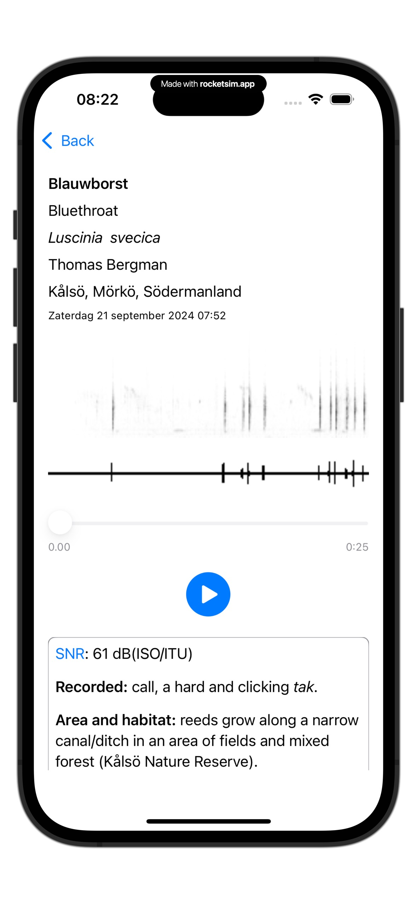

# XC

De **XC**-app stelt gebruikers in staat om **audio opnames van xeno-canto.org** te beluisteren. Deze app haalt de informatie op van [xeno-canto](https://www.xeno-canto.org) en presenteert deze gegevens op een overzichtelijke manier. 

Deze app is ontworpen om het verkennen van de natuur nog leuker te maken. Als je opmerkingen hebt om de app te verbeteren, stuur dan een e-mail naar [edequartel@protonmail](mailto:edequartel@protonmail).

## TestFlight
Gebruik de link [XC TestFlight](https://testflight.apple.com/join/QXHpHe6b) of scan de QR-code en je kunt de app testen via TestFlight op je iPhone. Je krijgt dan instructies over hoe je de app moet installeren.

* [Wikipedia - Xeno-Canto](https://en.wikipedia.org/wiki/Xeno-canto)

## Koffie?
Het ontwikkelen van de app doe ik geheel vrijwillig, iedereen kan hier gebruik van maken. Om de kosten een beetje te dekken en je beleeft plezier aan **XC** trakteer me dan op een [**kopje koffie**](https://www.buymeacoffee.com/4f4r4t6ytba) .

